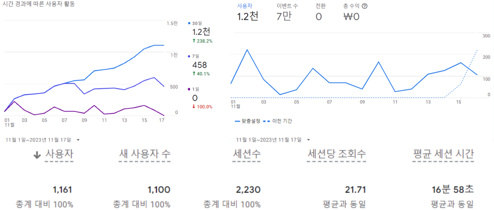
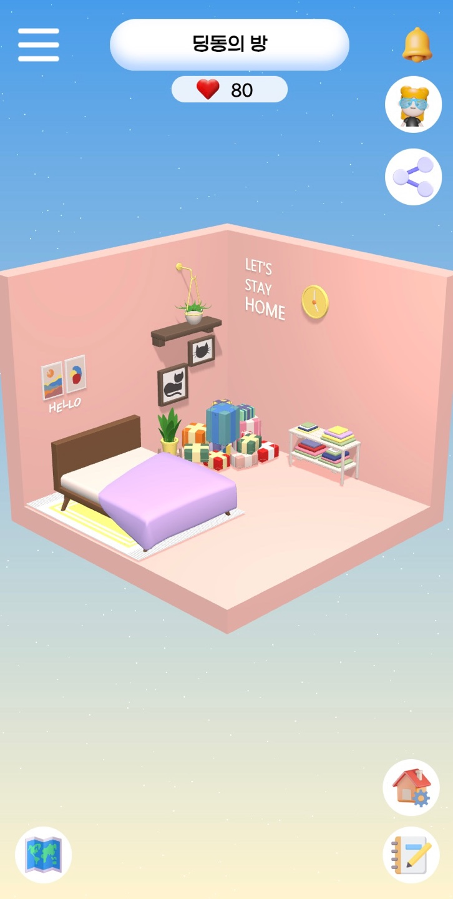
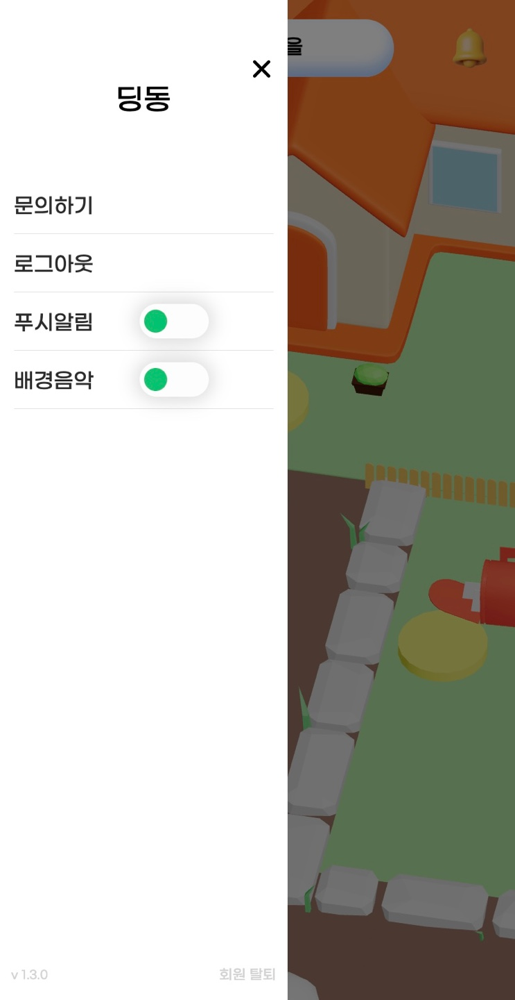
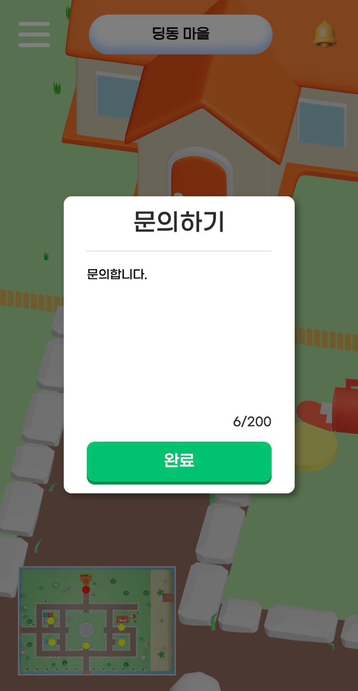
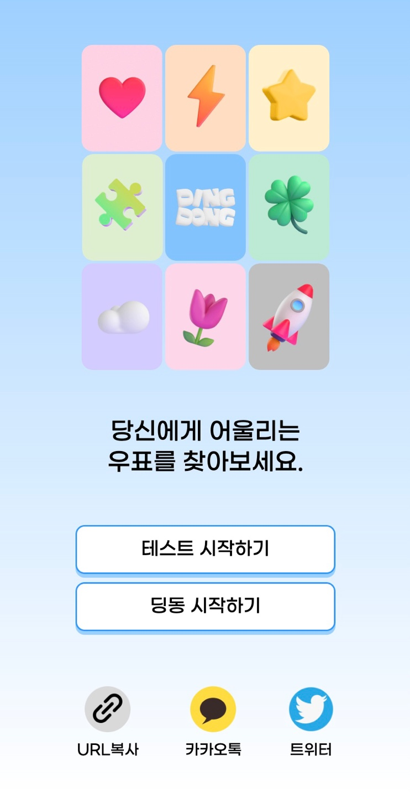
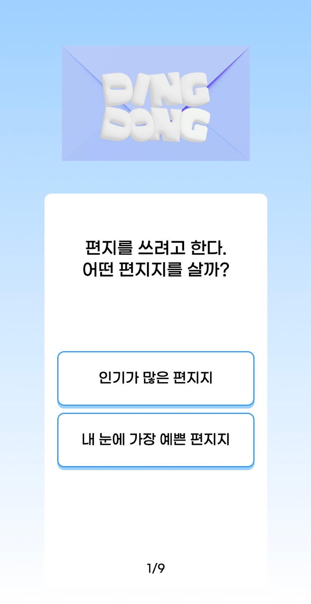
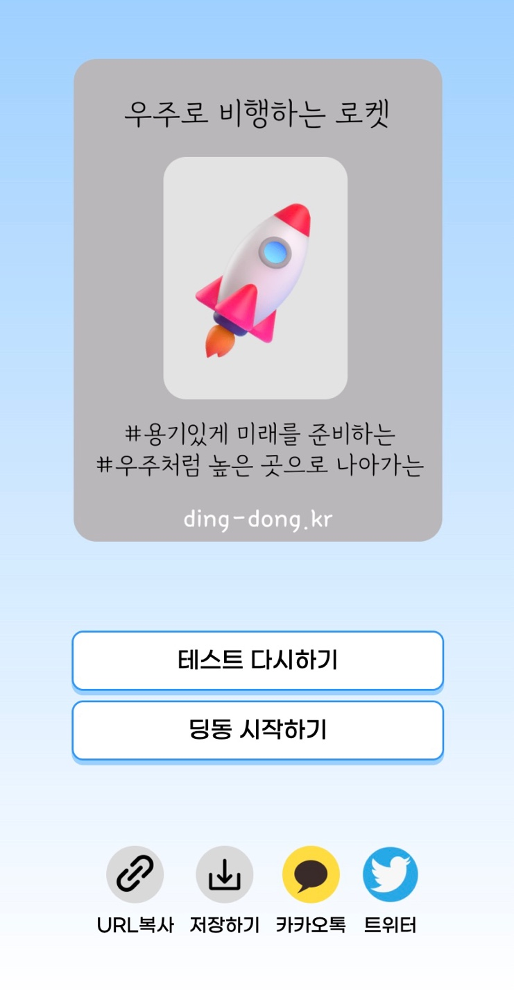
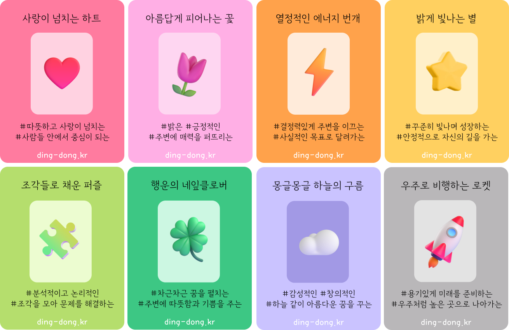
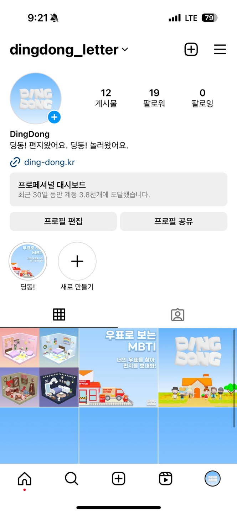

# :love_letter: 딩동! 편지왔어요. 딩동! 놀러왔어요. :house:

    

  
 

## 목차
1. [프로젝트 개요](#프로젝트-소개)
2. [성과](#성과)
3. [기능](#기능)
4. [버그](#버그)
5. [마케팅](#마케팅)
6. [개발 환경 및 기술 스택](#개발-환경-및-기술-스택)
7. [프로젝트 산출물](#프로젝트-산출물)
8. [팀원](#팀원)
 

# 프로젝트 개요
- SSAFY 9기 2학기 자율 프로젝트  
- 2023.10.10 ~ 2023.11.17 (39일)
 

# 성과
- 운영 기간: 2023.11.02 ~ 2023.11.17 (**16일**)
- 발생 이벤트 수: 약 **70,000**회+
- 총 사용자 수: 약 **1,200**명+ (_Google Analytics 기준_)   
  

 

# 기능 
### 딩동 마을 
- 나의 방, 우체통, 우체국, 주민 방, 딩동 스코어 보드, 딩동 광장으로 이동 할 수 있습니다.  
 

***

### 나의 방
#### 입장하기
- 딩동 마을에서 나의 방으로 이동할 수 있습니다.
    

#### 방 꾸미기 
- 다양한 카테고리의 가구들을 통해 방을 꾸밀 수 있습니다.
- 벽지와 조명 색을 바꿔 자신만의 개성을 표현할 수 있습니다.
 
 
 
 

 
#### 공유하기 
- 현재 방의 모습을 담은 이미지를 저장하거나 방 url과 함께 SNS로 공유할 수 있습니다.
  
 

#### 방명록
- 방명록을 확인, 작성, 신고 할 수 있습니다.
   
 
 

#### 이웃
- 이웃 목록을 통해 이웃의 방에 방문하거나, 이웃을 취소 할 수 있습니다.
  

#### 좋아요
- 나의 방에 받은 좋아요 수를 확인할 수 있습니다.
 

***

### 편지함
- 집 앞 편지함에서 주민들이 보낸 편지를 확인, 신고 할 수 있습니다.

***

### 우체국
#### 입장하기 
- 딩동 마을에서 우체국으로 이동할 수 있습니다.

#### 편지 보내기 
- 딩동 주민들의 닉네임을 검색하여 우표를 선택 후 의미를 담은 편지를 보낼 수 있습니다.

***

### 주민의 방 

#### 입장하기 
- 딩동 마을에서 주민의 방으로 이동할 수 있습니다. 

#### 주민의 방 둘러보기
- 주민의 방을 랜덤으로 방문 할 수 있습니다.
- 방문한 방에서 좋아요, 방명록을 남기거나 이웃 신청을 할 수 있습니다.

***

### 딩동 스코어보드
- 현 시점 기준 방꾸왕, 인기왕, 소통왕을 확인하고 해당 주민의 방을 방문할 수 있습니다.
 

***

### 딩동 광장
#### 입장하기 
- 딩동 마을에서 광장으로 이동할 수 있습니다.

- 광장에서 다양한 사람들을 만나 실시간으로 소통할 수 있습니다.
- 채팅, 춤추기, 기뻐하기, 슬퍼하기, 주사위 게임 등의 상호작용이 가능합니다.

 

***

### 메뉴
- 메뉴에서 관리자에게 문의, 로그아웃, 푸시 알림을 ON/OFF, 배경 음악을 ON/OFF 할 수 있습니다.
 

#### 문의하기
- 관리자에게 문의 할 수 있습니다.
 

#### 푸시 알림
- 푸시 알림을 통해 나에게 온 편지, 나에게 온 이웃요청 등을 알 수 있습니다.
 

## 버그
#### 문제
- 개발자도구의 콘솔을 이용해 다량의 요청을 보내는 문제점 발견
 

#### 해결
- Ngnix에서 Rate Limiting으로 해결
 
 

## 마케팅

### 우표 유형 테스트 (우표 MBTI)
유행하는 MBTI 성격 유형 검사를 응용해, 우표 유형 검사 페이지를 제작했습니다. 우표에 대한 흥미를 높이고, 결과 공유를 통해 홍보가 될 수 있도록 하였습니다. 
정적 페이지로서, 서버와의 통신 없이 JSON 데이터로 관리하여 구현했습니다.
  

 
 

### 공식 SNS 운영
인스타그램, 트위터, Mattermost 등 SNS 공식 계정을 운영하며 서비스를 홍보하는 동시에 유저와의 소통 창구를 마련하였습니다.   

 
 

## 개발 환경 및 기술 스택
| FrontEnd                | BackEnd                         | DB                    | Infra                     | 협업툴    |
| ----------------------- | ------------------------------- | --------------------- |-------------------------- | -------- |
| React 18.2.0            | Java : Open JDK 17.0.9          | AWS RDS (MySQL 8.0.33)| AWS EC2 (Ubuntu 20.04 LTS)| GitLab   |
| Recoil 0.7.7            | Spring Boot 2.7.17              | Redis 7.2.2           | Nginx 1.18.0              | Jira     |
| Axios 1.4.0             | Spring : 5.3.30                 |                       | Docker 24.0.6             | Notion   |
| CSS3                    | SpringSecurity : 5.7.11         |                       | Jenkins 2.414.3           | figma    |
| HTML5                   | Gradle : 8.3                    |                       | SonarQube 10.2.1          | Postman  |
| npm 9.6.7               | jjwt: 0.9.1                     |                       | Grafana                   |          |
| JavaScript ES6          | Springfox: 3.0.0                |                       | Prometheus                |          |
| Three.js 0.157.0        | SockJS Client: 1.5.1            |                       |                           |          |
| Vite 4.4.5              | Stomp WebSocket: 2.3.4          |                       |                           |          |

## 프로젝트 산출물 

    
화면 정의서 & 와이어프레임

    
    
    
    

  

    
요구사항 정의서

    

  

    
시스템 아키텍처

    

  

    
ERD

    

 

    
API 명세서

    [Swagger](https://ding-dong.kr/api/swagger-ui/index.html)  
    

  

## 팀원
<table>
    <tr>
        <td height="140px" align="center"> 
             
        </td>
        <td height="140px" align="center">  
             </td>
        </td>
        <td height="140px" align="center">
             </td>
        </td>
        <td height="140px" align="center"> 
             </td>
        </td>
        <td height="140px" align="center">
             </td>        
        </td>
        <td height="140px" align="center">
             </td>
        </td>
    </tr>
    <tr>
        <td align="center"> <a href="https://github.com/Dayoung1014"> 이다영 </a></td>
        <td align="center"> <a href="https://github.com/97Kzone"> 강동표 </a></td>
        <td align="center"> <a href="https://github.com/KyongBeom"> 김용범 </a> </td>
        <td align="center"> <a href="https://github.com/KJH0406"> 김장호 </a> </td>
        <td align="center"> <a href="https://github.com/Semibro"> 김준형 </a></td>
        <td align="center"> <a href="https://github.com/meoldae"> 전준영 </a></td>
    </tr>
    <tr>
        <td align="center">Leader</td>
        <td align="center">Backend</td>
        <td align="center">Frontend</td>
        <td align="center">Frontend</td>
        <td align="center">Frontend</td>
        <td align="center">Backend</td>
    </tr>
</table>
 
