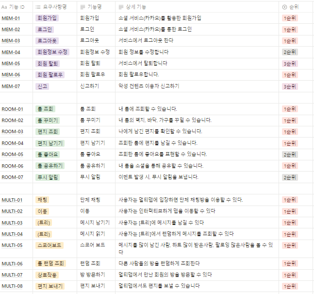
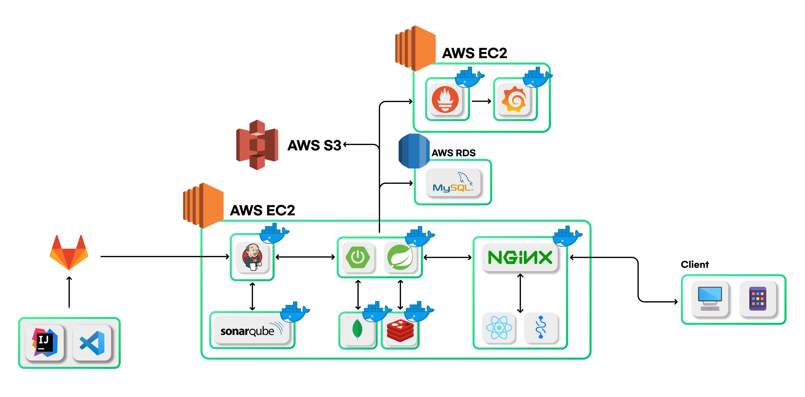
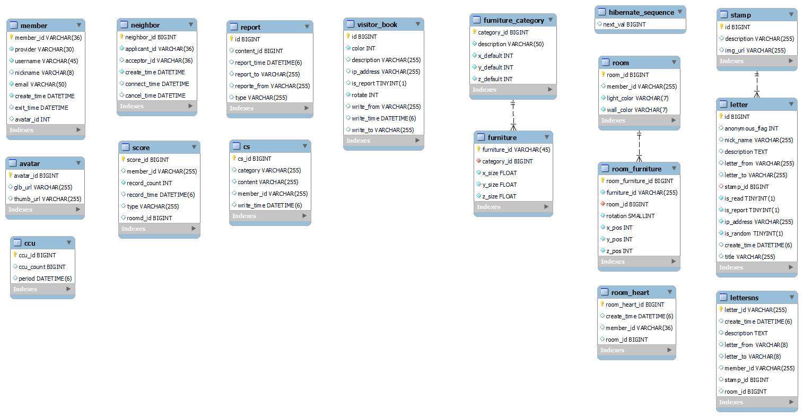
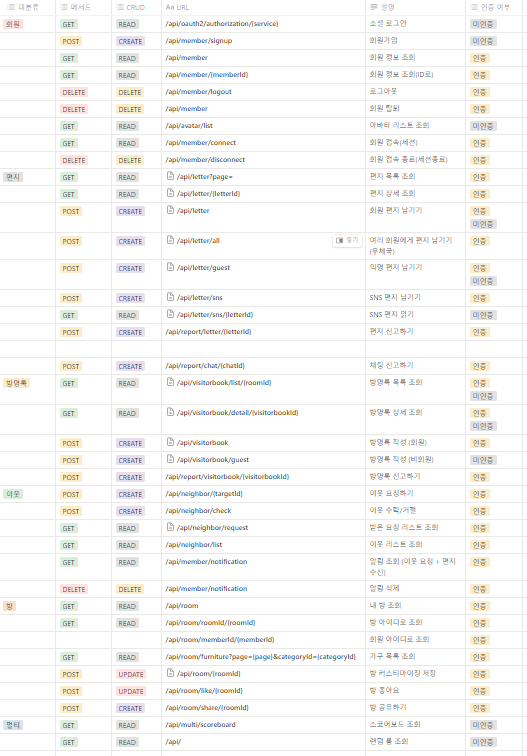

# :love_letter: 딩동! 편지왔어요. 딩동! 놀러왔어요. :house:

    

  
 

## 목차
1. [프로젝트 소개](#프로젝트-소개) 
2. [성과](#성과) 
3. [기능](#기능)  
4. [마케팅](#마케팅)
5. [개발 환경 및 기술 스택](#개발-환경-및-기술-스택) 
6. [프로젝트 산출물](#프로젝트-산출물) 
7. [팀원](#팀원)
 

## 프로젝트 소개
SSAFY 9기 2학기 자율 프로젝트  
2023.10.10 ~ 2023.11.17 (39일)
 

## 성과
- 운영 기간: 2023.11.02 ~ 2023.11.17 (16일)
- 발생 이벤트 수: 약 60,000회
- 총 사용자 수: 약 1,000명
 

## 기능

### 딩동 마을 
나의 방, 우체통, 우체국, 주민 방, 딩동 스코어 보드, 딩동 광장으로 이동 할 수 있습니다.

### 나의 방
방 꾸미기
- 가구를 통해 방을 꾸밀 수 있습니다.

공유하기
- 현재 방의 모습을 담은 이미지를 저장하거나 방 url과 함께 SNS로 공유할 수 있습니다.

방명록
- 방에 방문한 사람들의 방명록을 확인, 신고 할 수 있습니다.
이웃
- 이웃 목록을 통해 이웃의 방에 방문학거나, 이웃을 취소 할 수 있습니다.

좋아요
- 나의 방에 받은 좋아요 수를 확인할 수 있습니다.

### 편지함
집 앞 편지함에서 주민들이 보낸 편지를 확인 할 수 있습니다. 

### 우체국
딩동 주민들의 닉네임을 검색하여 우표를 선택 후 의미를 담은 편지를 보낼 수 있습니다.

### 주민의 방
주민의 방을 랜덤으로 방문 할 수 있습니다.
방문한 방에서 좋아요, 방명록을 남기거나 이웃 신청을 할 수 있습니다. 

### 딩동 스코어보드
방꾸왕
- 현 시점 기준 가장 많이 좋아요를 받은 주민을 확인하고 방을 방문할 수 있습니다.
인기왕
- 현 시점 기준 가장 많은 편지를 받은 주민을 확인하고 방을 방문할 수 있습니다.
소통왕 
- 현 시점 기준 가장 많이 편지를 보낸 주민을 확인하고 방을 방문할 수 있습니다.

### 딩동 주민 광장

### 실시간 알람

### 신고하기

### 문의하기

### 

## 마케팅 
### 우표 유형 테스트
### 공식 SNS 운영

## 개발 환경 및 기술 스택
| FrontEnd                | BackEnd                         | DB                    | Infra                     | 협업툴    |
| ----------------------- | ------------------------------- | --------------------- |-------------------------- | -------- |
| React 18.2.0            | Java : Open JDK 17.0.9          | AWS RDS (MySQL 8.0.33)| AWS EC2 (Ubuntu 20.04 LTS)| GitLab   |
| Recoil 0.7.7            | Spring Boot 2.7.17              | Redis 7.2.2           | Nginx 1.18.0              | Jira     |
| Axios 1.4.0             | Spring : 5.3.30                 |                       | Docker 24.0.6             | Notion   |
| CSS3                    | SpringSecurity : 5.7.11         |                       | Jenkins 2.414.3           | figma    |
| HTML5                   | Gradle : 8.3                    |                       | SonarQube 10.2.1          | Postman  |
| npm 9.6.7               | jjwt: 0.9.1                     |                       | Grafana                   |          |
| JavaScript ES6          | Springfox: 3.0.0                |                       | Prometheus                |          |
| Three.js 0.157.0        | SockJS Client: 1.5.1            |                       |                           |          |
| Vite 4.4.5              | Stomp WebSocket: 2.3.4          |                       |                           |          |

## 프로젝트 산출물 

화면 정의서 & 와이어프레임
 

  

요구사항 정의서
 
 

  

시스템 아키텍처
 
 

  

ERD
 
 

 

API 명세서
 
[Swagger](https://ding-dong.kr/api/swagger-ui/index.html)  
 

  

## 팀원
<table>
    <tr>
        <td height="140px" align="center"> 
             
        </td>
        <td height="140px" align="center">  
             </td>
        </td>
        <td height="140px" align="center">
             </td>
        </td>
        <td height="140px" align="center"> 
             </td>
        </td>
        <td height="140px" align="center">
             </td>        
        </td>
        <td height="140px" align="center">
             </td>
        </td>
    </tr>
    <tr>
        <td align="center"> <a href="https://github.com/Dayoung1014"> 이다영 </a></td>
        <td align="center"> <a href="https://github.com/97Kzone"> 강동표 </a></td>
        <td align="center"> <a href="https://github.com/KyongBeom"> 김용범 </a> </td>
        <td align="center"> <a href="https://github.com/KJH0406"> 김장호 </a> </td>
        <td align="center"> <a href="https://github.com/Semibro"> 김준형 </a></td>
        <td align="center"> <a href="https://github.com/meoldae"> 전준영 </a></td>
    </tr>
    <tr>
        <td align="center">Leader</td>
        <td align="center">Backend</td>
        <td align="center">Frontend</td>
        <td align="center">Frontend</td>
        <td align="center">Frontend</td>
        <td align="center">Backend</td>
    </tr>
</table>
 
